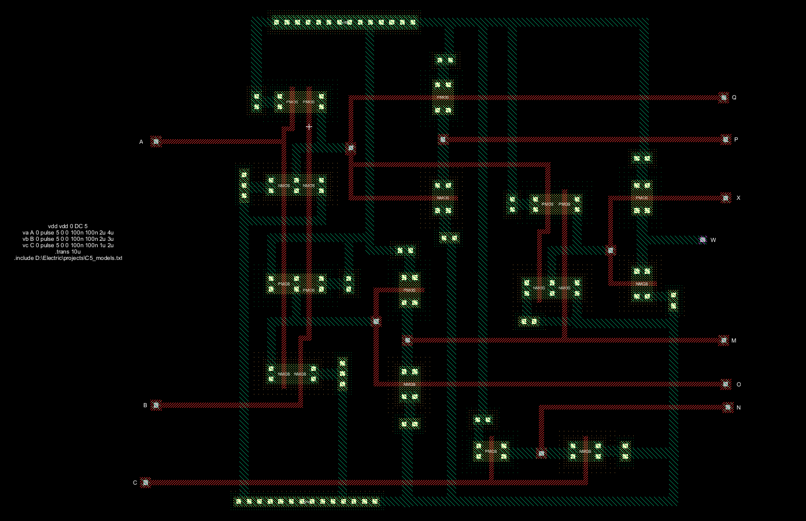
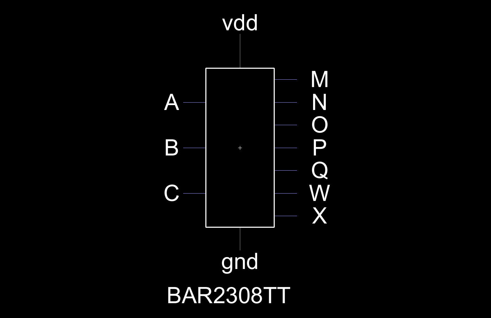
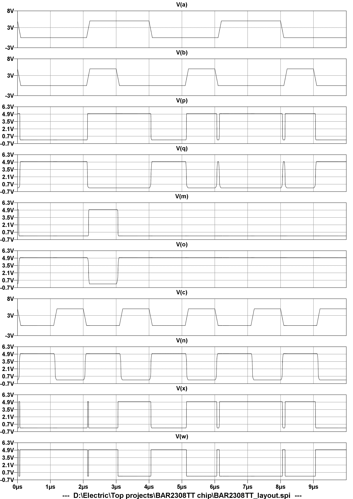

# BAR2308TT
A SSI Digital IC that will give us outputs of all the Logic gates.This design is based on 180nm technology.

| Input pin | Output pin |
| --- | --- |
| **A** , **B** , **C** | **P** , **M** , **N** , **Q** , **O** , **X** , **W** |

## An ic with all logic gates functionality

## 1. Use as OR gate


## 2. Use as AND gate


## 3. Use as NOT gate


## 4. **Use as NOR gate**


## 5. Use as NAND gate


## 6. Use as XOR gate


## 7. Use as XNOR gate


## 8. Use as Half-adder


[See Details](./box/Bar2308tt_presentation.pdf)


# Integrated Circuit's Layout

## Integrated Circuit's Icon view

## Simulation results

***To simulate this I used LTspice and spice code is -***
```spice
vdd vdd 0 DC 5
va A 0 pulse 5 0 0 100n 100n 2u 4u
vb B 0 pulse 5 0 0 100n 100n 2u 3u
vc C 0 pulse 5 0 0 100n 100n 1u 2u
.trans 10u
.include D:\Electric\projects\C5_models.txt
```

## 🛡️ License

BAR2308TT is licensed under MIT license. 
[See the license](./LICENSE.md)

## Project Author :

**[Amit Barman](https://abhisandhi.netlify.app/)**<br>
Undergraduate Student, Electronics & Telecommunication Engineering,IIESTS

The author of this work hereby waives all claim of copyright (economic and moral) in this work and immediately places it in the public domain; it may be used, distorted or destroyed in any manner whatsoever without further attribution or notice to the creator.
