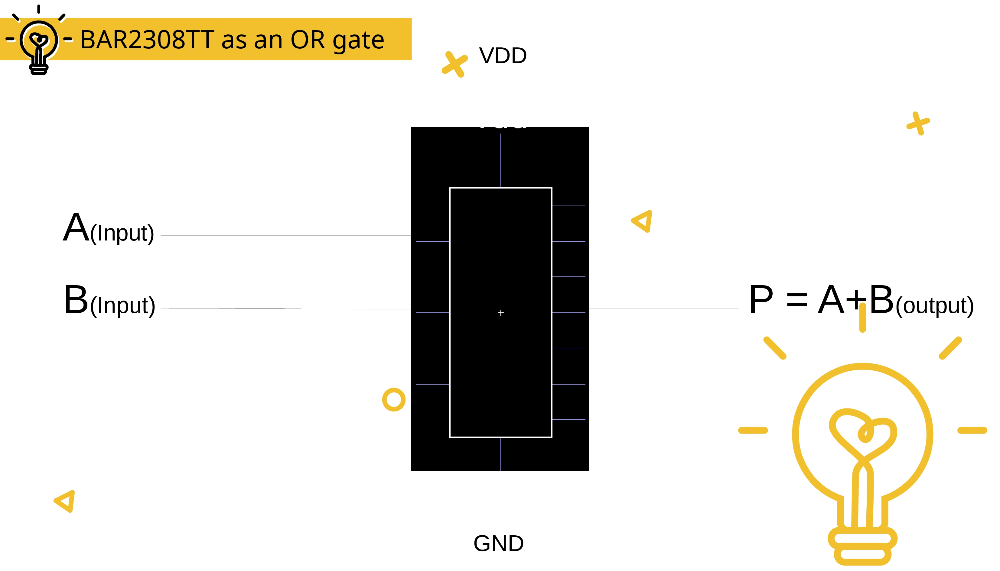
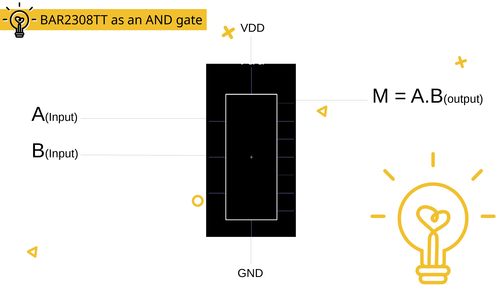
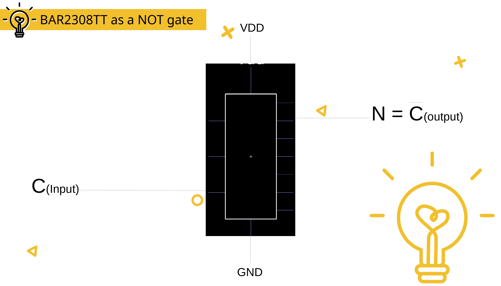
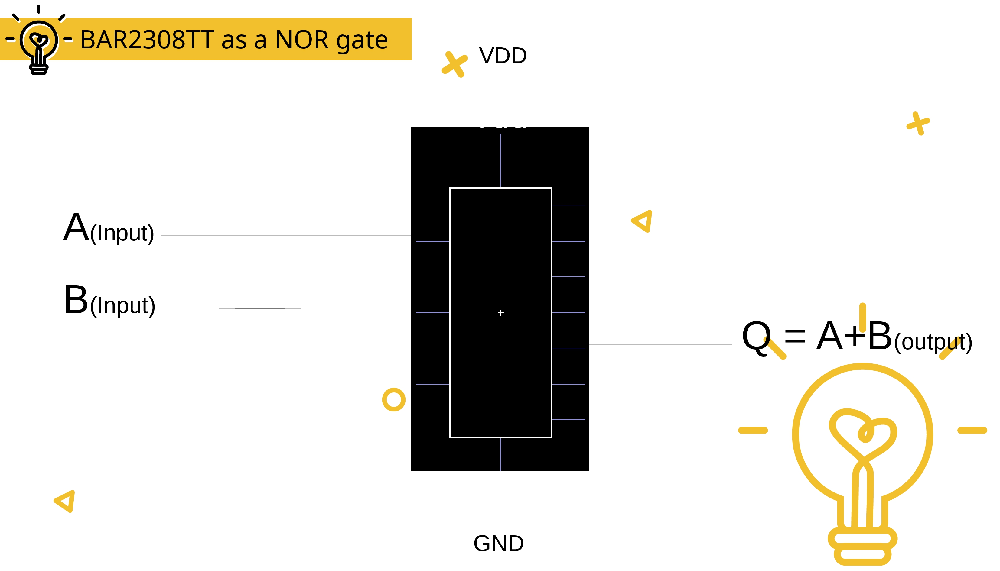
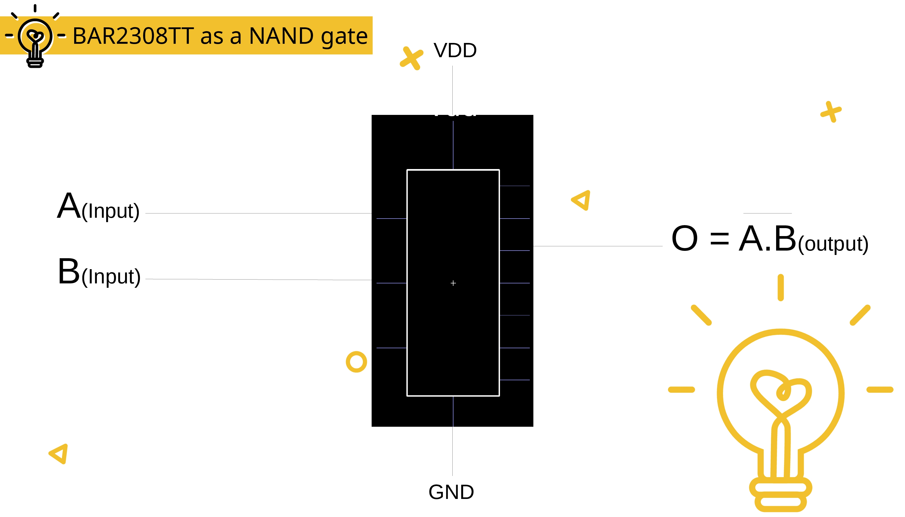
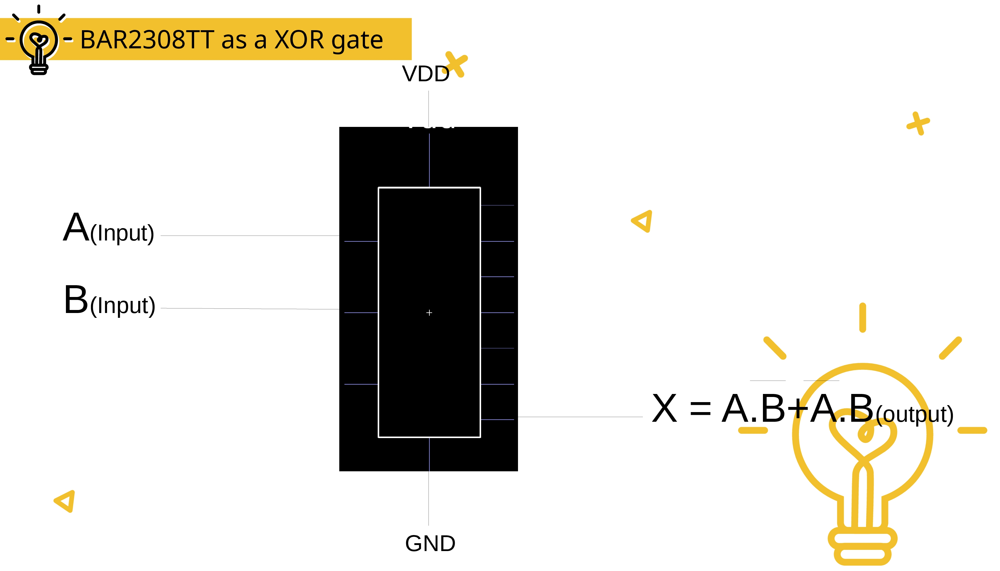
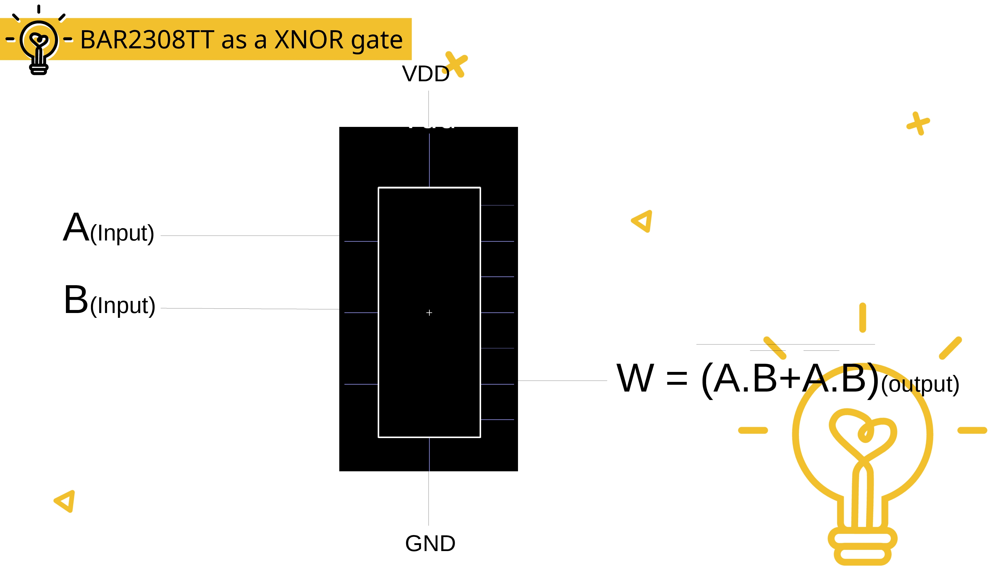
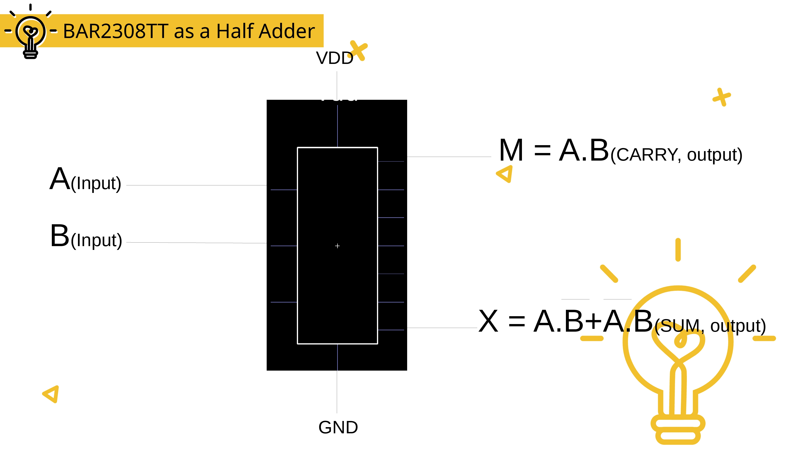

# BAR2308TT
A SSI Digital IC that will give us outputs of all the Logic gates

## An ic with all logic gates functionality

## 1. Use as OR gate

## 2. Use as AND gate

## 3. Use as NOT gate

## 4. **Use as NOR gate**

## 5. Use as NAND gate

## 6. Use as XOR gate

## 7. Use as XNOR gate

## 8. Use as Half-adder

[See Details](./box/Bar2308tt_presentation.pdf)

## 🛡️ License

BAR2308TT is licensed under MIT license. 
[See the license](./LICENSE.md)

## All the best

~ Designed by **[Amit Barman](https://abhisandhi.netlify.app/)**
